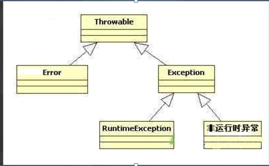
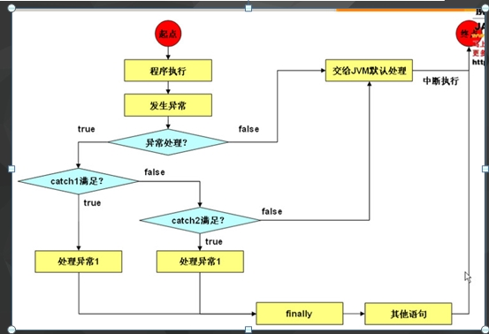

# 异常的介绍
===============================

* 异常：就是程序在运行时出现的不正常情况。
* 问题也是程序中一个具体的事物，也可以通过java的类的形式进行描述，并封装成对象。
* 其实就是java对不正常情况进行描述后的对象体现。

* 

* 

* 异常处理

	try{
		//需要检测的代码；
	}
	catch(异常类 变量) {
		//异常处理代码；
	}
	catch(异常类 变量) {
		//异常处理代码；
	}
	finally{
		//一定会执行的代码；
	}

	* 处理过程：try中检测到异常会将异常对象传递给catch，catch捕获到异常进行处理。
	* 注意：try是一个独立的代码块，在其中定义的变量只在该变量块中有效。
		如果在try以外需要继续使用，需要在try外建立引用，在try内对其进行初始化；
		
* 自定义异常
	
	package com.feicuiedu.demo3;

	/**
	 * Created by chenyan on 2016/9/28.
	 */
	public class MyException extends  Exception {

		private String message;

		public MyException(String message) {
			this.message = message;
		}

		@Override
		public String getMessage() {
			return message;
		}

	}

