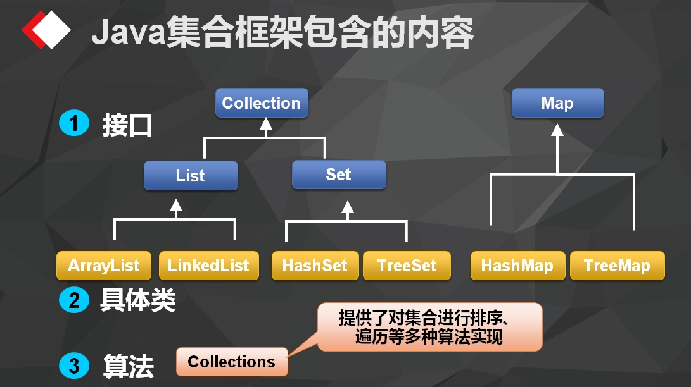
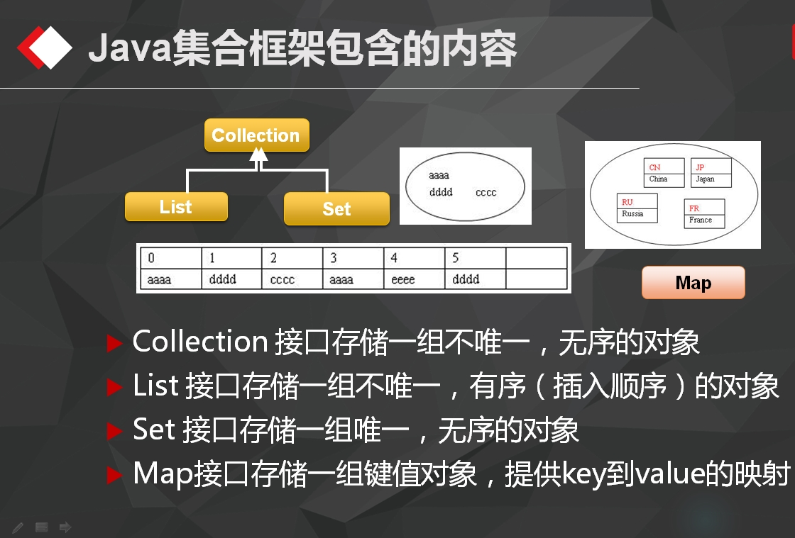

#集合的使用
===============================

* 集合类的结构图和主要用法

  
  
  
  
* 掌握方法
	
	  * 如何创建
	  
	  * 如何添加元素
	  
	  * 如何修改元素
	  
	  * 如何删除元素
	  
	  * 如何遍历 
	
* 泛型：规范类型
  	
  
*  list&map

	* ArrayList  可变数组
	
		import java.util.ArrayList;
		import java.util.Iterator;
		import java.util.List;

		/**
		 * Created by chenyan on 2016/9/27.
		 */
		public class ListDemo {

			public static void main(String[] args) {

				// 创建
				List<String> list = new ArrayList<String>();

				// 添加
				list.add("毛泽东");

				list.add("周恩来");

				list.add("刘少奇");

				list.add(2,"朱德");

				// list.add("林彪");

				//  修改
				// list.set(0,"林彪");

				// 删除
				// list.remove(0);
				list.remove("毛泽东");

				// 查询遍历
				for(int index = 0;index< list.size();index ++) {
					String name = list.get(index);
					System.out.println(name);
				}

				System.out.println("*******************************");
				for (String name : list) {
					System.out.println(name);
				}

				System.out.println("*******************************");
				Iterator<String> it = list.iterator();
				while(it.hasNext()) {
					String name = it.next();
					System.out.println(name);
				}
			}
		}

	
	* LinkedList 链表
	
    
	  
	  