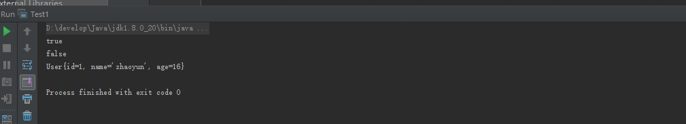

#集合的使用
===============================

* 集合类的结构图和主要用法

  
  
  
  
* 掌握方法
	
	  * 如何创建
	  
	  * 如何添加元素
	  
	  * 如何修改元素
	  
	  * 如何删除元素
	  
	  * 如何遍历 
	
* 泛型：规范类型
  	
  
*  list

	* ArrayList  可变数组
	
		import java.util.ArrayList;
		import java.util.Iterator;
		import java.util.List;

		/**
		 * Created by chenyan on 2016/9/27.
		 */
		public class ListDemo {

			public static void main(String[] args) {

				// 创建
				List<String> list = new ArrayList<String>();

				// 添加
				list.add("毛泽东");

				list.add("周恩来");

				list.add("刘少奇");

				list.add(2,"朱德");

				// list.add("林彪");

				//  修改
				// list.set(0,"林彪");

				// 删除
				// list.remove(0);
				list.remove("毛泽东");

				// 查询遍历
				for(int index = 0;index< list.size();index ++) {
					String name = list.get(index);
					System.out.println(name);
				}

				System.out.println("*******************************");
				for (String name : list) {
					System.out.println(name);
				}

				System.out.println("*******************************");
				Iterator<String> it = list.iterator();
				while(it.hasNext()) {
					String name = it.next();
					System.out.println(name);
				}
			}
		}

	
	* LinkedList 链表
	
		* 在集合任何位置（头部、中间、尾部）添加、获取
		
		* 插入、删除操作频繁时，可使用LinkedList来提高效率
		
		* LinkedList还额外提供对头部和尾部元素进行添加和删除操作的方法 
		
		import java.util.ArrayList;
		import java.util.Iterator;
		import java.util.LinkedList;
		import java.util.List;

		/**
		 * Created by chenyan on 2016/9/27.
		 */
		public class LinkedListDemo {

			public static void main(String[] args) {

				// 创建
				LinkedList<String> list = new LinkedList<>();

				// 添加
				list.add("毛泽东");

				list.add("周恩来");

				list.add("刘少奇");

				list.add(2,"朱德");

				// list.add("林彪");

				//  修改
				// list.set(0,"林彪");

				// 删除
				// list.remove(0);
				list.remove("毛泽东");

				list.addFirst("陈独秀");
				list.addLast("华国锋");
				// 查询遍历
				for(int index = 0;index< list.size();index ++) {
					String name = list.get(index);
					System.out.println(name);
				}

				System.out.println("*******************************");
				for (String name : list) {
					System.out.println(name);
				}

				System.out.println("*******************************");
				Iterator<String> it = list.iterator();
				while(it.hasNext()) {
					String name = it.next();
					System.out.println(name);
				}
			}
		}

* set
	
	* Set接口也是Collection接口的子接口，但是与Collection或List接口不同的是，Set接口中不能加入重复的元素。
	
	* Set接口的定义： public interface Set<E> extends Collection<E>
	
	* Set接口的主要方法与Collection是一致的 
	
	* Set接口的实例无法像List接口那样进行双向输出
	
	* Set接口的常用子类 
	
		* HashSet (散列的存放) :
		  
		  HashSet是Set接口的一个实现类，
		  主要的特点是：
			里面不能存放重复元素，
			采用散列的存储方式，所以是没有顺序(插入顺序)的。 
			
			
		import java.util.HashSet;
		import java.util.Iterator;
		import java.util.LinkedList;

		/**
		 * Created by chenyan on 2016/9/27.
		 */
		public class HashSetDemo {

			public static void main(String[] args) {

				// 创建
				HashSet<String> list = new HashSet<String>();

				// 添加
				list.add("毛泽东");

				list.add("周恩来");

				list.add("刘少奇");

				// list.add("林彪");

				//  修改
				// list.set(0,"林彪");

				// 删除
				// list.remove(0);
				// list.remove("毛泽东");

				// 查询遍历

				for (String name : list) {
					System.out.println(name);
				}

				System.out.println("*******************************");
				Iterator<String> it = list.iterator();
				while(it.hasNext()) {
					String name = it.next();
					System.out.println(name);
				}
			}
		}
		
		* TreeSet (有序的存放) :
		
			* 输入的数据进行有序排列

				import java.util.Iterator;
				import java.util.TreeSet;

				/**
				 * Created by chenyan on 2016/9/27.
				 */
				public class TreeSetDemo {

					public static void main(String[] args) {

						// 创建
						TreeSet<String> list = new TreeSet<String>();

						// 添加
						list.add("b毛泽东");

						list.add("a周恩来");

						list.add("c刘少奇");

						// list.add("林彪");

						//  修改
						// list.set(0,"林彪");

						// 删除
						// list.remove(0);
						// list.remove("毛泽东");

						// 查询遍历

						for (String name : list) {
							System.out.println(name);
						}

						System.out.println("*******************************");
						Iterator<String> it = list.iterator();
						while(it.hasNext()) {
							String name = it.next();
							System.out.println(name);
						}
					}
				}
				
			* TreeSet的排序说明 
			
				* 一个普通的类对象是不能向TreeSet集合中加入的，
				  如果直接加入会出现以下的异常：java.lang.ClassCastException
				  
				* 如果要想使用TreeSet则对象所在的类必须实现Compable接口
				
					package com.feicuiedu.demo3;

					import java.util.Iterator;
					import java.util.TreeSet;

					/**
					 * Created by chenyan on 2016/9/28.
					 */
					public class TreeSetDemo {

						public static void main(String[] args) {

							User liubei = new User(1,"liubei", 40);
							User guanyu = new User(2,"guyuan", 30);
							User zhangfei = new User(3,"zhangfei", 29);
							User zhugeliang = new User(4,"zhugeliang", 25);
							User zhaoyun = new User(1,"zhaoyun", 16);

							TreeSet<User> userSet = new TreeSet<User>();

							userSet.add(zhaoyun);
							userSet.add(liubei);
							userSet.add(guanyu);
							userSet.add(zhugeliang);
							userSet.add(zhangfei);

							Iterator<User> it = userSet.iterator();
							while(it.hasNext()) {
								User u = it.next();
								System.out.println(u);
							}

						}
					}
					class User implements Comparable{
						private int id;
						private String name;
						private int age;

						public int getId() {
							return id;
						}

						public String getName() {
							return name;
						}

						public int getAge() {
							return age;
						}

						public User(int id, String name, int age) {
							this.id = id;
							this.name = name;
							this.age = age;
						}

						@Override
						public int compareTo(Object o) {

							User u = (User)o;
							int res = 0;
							if (age > u.age) {
								res = 2;
							}
							else if (age == u.age) {
								res =0;
							}
							else {
								res = -12;
							}
							return res;
						}

						@Override
						public String toString() {
							return "User{" +
									"id=" + id +
									", name='" + name + '\'' +
									", age=" + age +
									'}';
						}
					}
					
					* 关于重复元素的说明 
						
						* Set接口中是不允许存放重复元素的
						
							package com.feicuiedu.demo3;

							import java.util.Scanner;
							import java.util.Set;
							import java.util.HashSet;
							import java.util.Iterator;
							import java.util.Random;

							/**
							 * Created by chenyan on 2016/9/28.
							 */
							public class Test {

								// 模拟 35 选7
								public static void main(String[] args) {
									Scanner scanner = new Scanner(System.in);
									System.out.print("请输入号码的总个数:");
									int totalCount = scanner.nextInt();
									System.out.print("请输入号开奖号码的总个数:");
									int selectCount = scanner.nextInt();

									System.out.println("本期"+totalCount+"选"+selectCount+"开奖的结果是：");
									Test t = new Test();
									String str = t.genNumber(totalCount,selectCount);
									System.out.println(str);
								}

								/**
								 *  生成彩票号码
								 * @param totalCount 号码的总个数
								 * @param selectCount 开奖号码的总个数
								 * @return 中奖号码的明细以","隔开
								 */
								public String genNumber(int totalCount,int selectCount ) {

									Random random = new Random();

									Set<Integer> set = new HashSet<Integer>();

									while (true) {
										int number = random.nextInt(totalCount);

										if (number ==0) {
											continue;
										}
										set.add(number);

										if (set.size() == selectCount) {
											break;
										}
									}

									Iterator<Integer> it = set.iterator();

									StringBuffer sb = new StringBuffer();
									while (it.hasNext()) {
										int index = it.next();
										sb.append(index+",");
									}
									//sb.deleteCharAt(sb.length()-1);
									String str = sb.substring(0,sb.length()-1);

									return str;
								}
							}

						* 一个类的对象是否重复需要依靠Object类中的以下方法完成：
						
							hashCode()：指定哈希码
							equals()：对象比较
							
						package com.feicuiedu.demo3;

						/**
						 * Created by chenyan on 2016/9/28.
						 */
						public class User implements Comparable{
							private int id;
							private String name;
							private int age;

							public int getId() {
								return id;
							}

							public String getName() {
								return name;
							}

							public int getAge() {
								return age;
							}

							public User(int id, String name, int age) {
								this.id = id;
								this.name = name;
								this.age = age;
							}

							@Override
							public int compareTo(Object o) {

								User u = (User)o;
								int res = 0;
								if (age > u.age) {
									res = 2;
								}
								else if (age == u.age) {
									res =0;
								}
								else {
									res = -12;
								}
								return res;
							}

							@Override
							public String toString() {
								return "User{" +
										"id=" + id +
										", name='" + name + '\'' +
										", age=" + age +
										'}';
							}

							@Override
							public boolean equals(Object o) {
								/*if (this == o) return true;
								if (o == null || getClass() != o.getClass()) return false;

								User user = (User) o;

								if (id != user.id) return false;
								if (age != user.age) return false;
								return name != null ? name.equals(user.name) : user.name == null;*/

								return true;

							}

							@Override
							public int hashCode() {
							   /* int result = id;
								result = 31 * result + (name != null ? name.hashCode() : 0);
								result = 31 * result + age;*/
								return 1;
							}
						}
						
						package com.feicuiedu.demo3;

						import java.util.HashSet;
						import java.util.Iterator;

						/**
						 * Created by chenyan on 2016/9/28.
						 */
						public class Test1 {

							public static void main(String[] args) {

								User liubei = new User(1,"liubei", 40);
								User guanyu = new User(2,"guyuan", 30);
								User zhangfei = new User(3,"zhangfei", 29);
								User zhugeliang = new User(4,"zhugeliang", 25);
								User zhaoyun = new User(1,"zhaoyun", 16);

								HashSet<User> userSet = new HashSet<User>();

								userSet.add(zhaoyun);
								userSet.add(liubei);
								userSet.add(guanyu);
								userSet.add(zhugeliang);
								userSet.add(zhangfei);

								System.out.println(liubei.equals("adfasdf"));
								System.out.println(liubei==guanyu);

								Iterator<User> it = userSet.iterator();
								while(it.hasNext()) {
									User u = it.next();
									System.out.println(u);
								}
							}
						}

						
					* 运行结果
					

* map 

	* HashMap
	
	package com.feicuiedu.demo3;

	import java.util.HashMap;
	import java.util.Iterator;
	import java.util.Map;
	import java.util.Set;

	/**
	 * Created by chenyan on 2016/9/28.
	 */
	public class MapDemo {

		public static void main(String[] args) {

			// 创建
			Map<String,String> countries = new HashMap<String, String>();

			// 对map添加输入
			countries.put("CN", "中华人民共和国");
			countries.put("RU", "俄罗斯联邦");
			countries.put("FR", "法兰西共和国");
			countries.put("US", "美利坚合众国");

			// 查询
			String country = (String) countries.get("CN");

			// 遍历
			// 使用Map.Entry<String, String>
			Set<Map.Entry<String, String>> set = countries.entrySet();
			Iterator<Map.Entry<String,String>> it = set.iterator();

			while(it.hasNext()) {
				Map.Entry<String,String> entry = it.next();
				String key = entry.getKey();
				String value = entry.getValue();
				// json标准
				System.out.println(key+":"+value+",");
			}

			System.out.println("******************************");

			// 删除
			//countries.remove("US");

			// 使用keySet 遍历
			Set<String> setKey = countries.keySet();
			Iterator<String> itKey = setKey.iterator();
			while(itKey.hasNext()) {
				String key = itKey.next();
				String value = countries.get(key);

				System.out.println(key+":"+value+",");
			}

			boolean bln = countries.containsKey("ccc");
			boolean bln1 = countries.containsValue("美利坚合众国");

			System.out.println("bln="+bln+" bln1="+bln1);
		   /* System.out.println("CN对应的国家是：" + country);
			System.out.println("Map中共有" + countries.size() + "组数据");*/
		}
	}
	
	
	* TreeMap
		
		package com.feicuiedu.demo3;

		import java.util.*;

		/**
		 * Created by chenyan on 2016/9/28.
		 */
		public class TreeMapDemo {

			public static void main(String[] args) {

				// 创建
				TreeMap<String,String> countries = new TreeMap<String, String>();

				// 对map添加输入
				countries.put("CN", "中华人民共和国");
				countries.put("RU", "俄罗斯联邦");
				countries.put("FR", "法兰西共和国");
				countries.put("US", "美利坚合众国");

				// 查询
				String country = (String) countries.get("CN");

				// 遍历
				// 使用Map.Entry<String, String>
				Set<Map.Entry<String, String>> set = countries.entrySet();
				Iterator<Map.Entry<String,String>> it = set.iterator();

				while(it.hasNext()) {
					Map.Entry<String,String> entry = it.next();
					String key = entry.getKey();
					String value = entry.getValue();
					// json标准
					System.out.println(key+":"+value+",");
				}

				System.out.println("******************************");

				// 删除
				//countries.remove("US");

				// 使用keySet 遍历
				Set<String> setKey = countries.keySet();
				Iterator<String> itKey = setKey.iterator();
				while(itKey.hasNext()) {
					String key = itKey.next();
					String value = countries.get(key);

					System.out.println(key+":"+value+",");
				}

				boolean bln = countries.containsKey("ccc");
				boolean bln1 = countries.containsValue("美利坚合众国");

				System.out.println("bln="+bln+" bln1="+bln1);
			   System.out.println("CN对应的国家是：" + country);
				System.out.println("Map中共有" + countries.size() + "组数据");
			}
		}

	
    
	  
	  